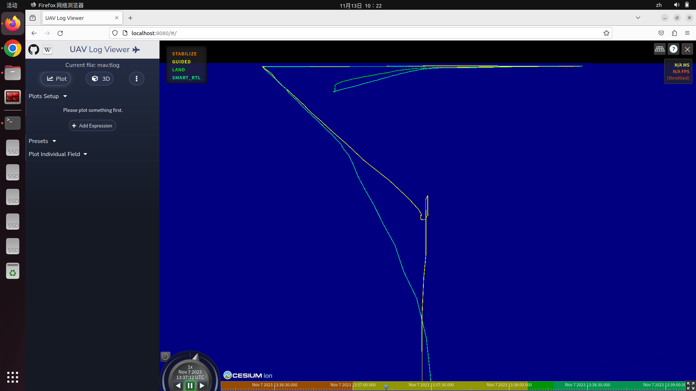
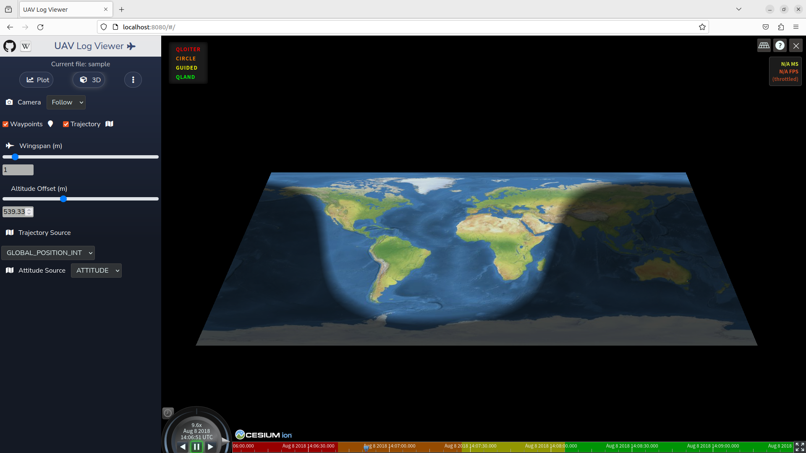

# UAV Log Viewer(本分支为纯离线模式)





 This is a Javascript based log viewer for Mavlink telemetry and dataflash logs.
 [Live demo here](http://plot.ardupilot.org).

## 运行环境

```bash
ubuntu 22.04 + nodejs v18.18.2 + npm 9.8.1
ubuntu 20.04 + nodejs v16.20.2 + npm 8.19.4
```

## Build Setup

``` bash
# install dependencies
npm install

# serve with hot reload at localhost:8080
npm run dev

# build for production with minification
npm run build

# run unit tests
npm run unit

# run e2e tests
npm run e2e

# run all tests
npm test
```

# Docker

``` bash

# Build Docker Image
docker build -t <your username>/uavlogviewer .

# Run Docker Image
docker run -p 8080:8080 -d <your username>/uavlogviewer

# View Running Containers
docker ps

# View Container Log
docker logs <container id>

# Navigate to localhost:8080 in your web browser

```

## 部分问题解决方案

```
code: 'ERR_OSSL_EVP_UNSUPPORTED'
```

**1. 降级到 Node.js v16。（可行）**

**2. 启用旧版 OpenSSL 提供程序。（可行）**

在类 Unix 上（Linux、macOS、Git bash 等）：

```bash
export NODE_OPTIONS=--openssl-legacy-provider
```